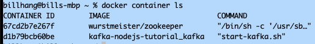
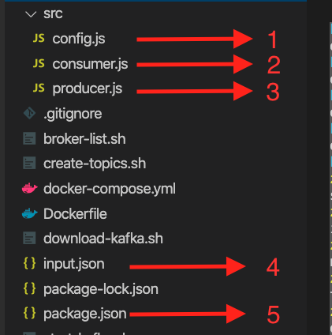
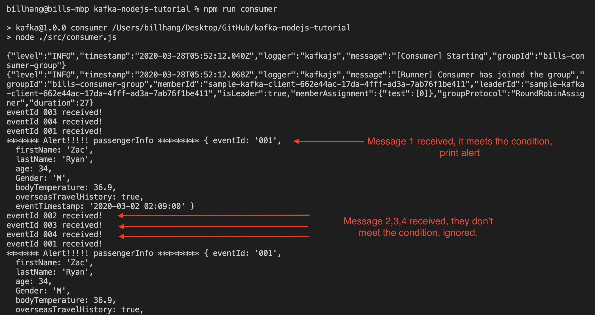
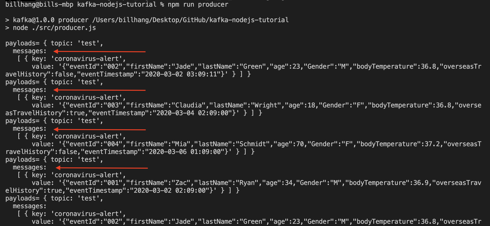

# kafka-nodejs-tutorial
# A sample application using Kafka, Node.js and Docker

#### Table of Content
* [1. About Kafka Streaming](#AboutKafkaStreaming)
* [2. Use case - track travellers who may infected by Coronavirus](#usecase)
* [3. Build local Kafka environemnt using Docker and Container](#build_local_kafka_environemnt)
* [4. Run the application](#run_the_application)
* [References](#references)

<a name="AboutKafkaStreaming"></a>
## 1. About Kafka Streaming

Below is the discription from the official Kafka web site.

Apache Kafka® is a distributed streaming platform.

It publishes and subscribes to streams of records, similar to a message queue or enterprise messaging syste

Kafka is generally used for two broad classes of applications:

Building real-time streaming data pipelines that reliably get data between systems or applications
Building real-time streaming applications that transform or react to the streams of data

To learn more about Kafka, please visit [Kafka official web site](https://kafka.apache.org/)

Kafka is build in Java, it does provide APIs from many other lanhuages.

Since I am a Javascript developer, I decided to use Node.js for this sample application.

There are a few libraries for Node.js, some popular libraries include:

* [node-rdkafka](https://github.com/Blizzard/node-rdkafka)

* [Kafka-node](https://www.npmjs.com/package/kafka-node)

* [KafkaJS](https://www.npmjs.com/package/kafkajs) 

I use KafkaJs in this example. The main reason is it has better documentation then the other two.


<a name="usecase"></a>
## 2. Use case - track travellers who may infected by Coronavirus

We are going to build an applicaiton, to track petential travellers who may have been infected by Coronavirus.

1. We check travellers temperature at major airports.
2. Temperature and traveller's personal infomration are sent to the Kafka queue (as producer). Note every airport is a prodcuer.
3. We have another app check every message sent to the queue (near real time), and alert is triggered if we a passenger has higher temperature and has overseas travel history.


<a name="build_local_kafka_environemnt"></a>
## 3. Build local Kafka environemnt using Docker and Container

In order to run the application locally, we need at least two docker images

* zookeeper
* Kafka Broker

In the real envirnment, you will need multiple Kafka brokers, to form a cluster.

In stead of build my own docker images, I cloned the code from https://github.com/wurstmeister/kafka-docker, which give me everything I need to run Kafka on my local computer.


```yml
version: "2"
services:
  zookeeper:
    image: wurstmeister/zookeeper
    ports:
      - "2181:2181"
  kafka:
    build: .
    ports:
      - "9092:9092"
    environment:
      KAFKA_ADVERTISED_HOST_NAME: localhost
      KAFKA_ZOOKEEPER_CONNECT: zookeeper:2181
      KAFKA_CREATE_TOPICS: "flight:1:1"
    volumes:
      - /var/run/docker.sock:/var/run/docker.sock

```

To bring up Kafka containers, run the command below from terminal

```
docker-compose up
```

You should see some message similar like this:

```
kafka_1      | [2020-03-27 21:35:48,478] INFO [GroupMetadataManager brokerId=1001] Finished loading offsets and group metadata from __consumer_offsets-39 in 0 milliseconds. (kafka.coordinator.group.GroupMetadataManager)
kafka_1      | [2020-03-27 21:35:48,479] INFO [GroupMetadataManager brokerId=1001] Finished loading offsets and group metadata from __consumer_offsets-42 in 1 milliseconds. (kafka.coordinator.group.GroupMetadataManager)
kafka_1      | [2020-03-27 21:35:48,479] INFO [GroupMetadataManager brokerId=1001] Finished loading offsets and group metadata from __consumer_offsets-45 in 0 milliseconds. (kafka.coordinator.group.GroupMetadataManager)
kafka_1      | [2020-03-27 21:35:48,480] INFO [GroupMetadataManager brokerId=1001] Finished loading offsets and group metadata from __consumer_offsets-48 in 1 milliseconds. (kafka.coordinator.group.GroupMetadataManager)
kafka_1      | creating topics: flight:1:1
zookeeper_1  | 2020-03-27 21:35:54,445 [myid:] - INFO  [NIOServerCxn.Factory:0.0.0.0/0.0.0.0:2181:NIOServerCnxnFactory@215] - Accepted socket connection from /172.21.0.3:57354
zookeeper_1  | 2020-03-27 21:35:54,451 [myid:] - INFO  [NIOServerCxn.Factory:0.0.0.0/0.0.0.0:2181:ZooKeeperServer@949] - Client attempting to establish new session at /172.21.0.3:57354
zookeeper_1  | 2020-03-27 21:35:54,454 [myid:] - INFO  [SyncThread:0:ZooKeeperServer@694] - Established session 0x100065ca9350001 with negotiated timeout 30000 for client /172.21.0.3:57354
zookeeper_1  | 2020-03-27 21:35:54,904 [myid:] - INFO  [ProcessThread(sid:0 cport:2181)::PrepRequestProcessor@487] - Processed session termination for sessionid: 0x100065ca9350001
zookeeper_1  | 2020-03-27 21:35:54,907 [myid:] - INFO  [NIOServerCxn.Factory:0.0.0.0/0.0.0.0:2181:NIOServerCnxn@1056] - Closed socket connection for client /172.21.0.3:57354 which had sessionid 0x100065ca9350001
^[[1;2B^[[1;2B^[[1;2B

```


To check if containers are up and running:

```
billhang@bills-mbp ~ % docker container ls
CONTAINER ID        IMAGE                         COMMAND                  CREATED             STATUS              PORTS                                                NAMES
67cd2b7e267f        wurstmeister/zookeeper        "/bin/sh -c '/usr/sb…"   35 hours ago        Up 3 minutes        22/tcp, 2888/tcp, 3888/tcp, 0.0.0.0:2181->2181/tcp   kafka-nodejs-tutorial_zookeeper_1
d1b79bcb60be        kafka-nodejs-tutorial_kafka   "start-kafka.sh"         35 hours ago        Up 3 minutes        0.0.0.0:9092->9092/tcp                               kafka-nodejs-tutorial_kafka_1
billhang@bills-mbp ~ %

```

You can see two containers are running, one for zookeeper and one for kafka broker



Now we we move to the next step and run the appliction


Reference: https://github.com/wurstmeister/kafka-docker

<a name="run_the_application"></a>
## 4. Run the application

Below is the folder structure:



  ### 1. config.js 
 
   It constainers all infrormation to initialise a newK afka client instance. 
   
   ```javascript
   module.exports = {
    kafka: {
      TOPIC: 'test',
      BROKERS: ['localhost:9092'],
      GROUPID: 'bills-consumer-group',
      CLIENTID: 'sample-kafka-client'
      }
   }

   
   ```

  ### 2. consumer.js

  It listens to the Kafka queue, and process every message coming to the queue. 
  
  
  * initialise a Kafa client and consumer instance
  
  ```javascript
  const kafka = new Kafka({
    clientId: config.kafka.CLIENTID,
    brokers: config.kafka.BROKERS
  })

  const topic = config.kafka.TOPIC
  const consumer = kafka.consumer({
    groupId: config.kafka.GROUPID
  })
  ```
  
  * process each message coming to the queue, if it meets the criteria (filterPassengerInfo), it prints the passenger information
    
  ```javascript
    await consumer.run({
    eachMessage: async ({ message }) => {
        try {
          const jsonObj = JSON.parse(message.value.toString())
          let passengerInfo = filterPassengerInfo(jsonObj)
          if (passengerInfo) {
            console.log(
              '******* Alert!!!!! passengerInfo *********',
              passengerInfo
            )
          }
        } catch (error) {
          console.log('err=', error)
        }
      }
    })
  
  ```
    Run the command below to start consumer.
  
  ```
  npm run consumer
  ```
  
 If the producer is running (step 3 below), you will see message coming through, and I will print  message which meets  conditions (has overseas travel history and temperature is great than or equal to 36.9)
  
  
  

  ### 3. producer.js

In the real senario, producer is running on different app, it contantly send message to the queue.

In example, We send mock data (input.json) to simulate a real environment.


  * Initialise a Kafa client and producer instance
  ```javascript
  const client = new Kafka({
    brokers: config.kafka.BROKERS,
    clientId: config.kafka.CLIENTID
  })

  const topic = config.kafka.TOPIC

  const producer = client.producer()

  ```
  
  * I then loop through input.json file, send message every 5 second
  
  ```javascript
  let i = 0

  const sendMessage = async (producer, topic) => {
    await producer.connect()

    setInterval(function() {
      i = i >= messages.length - 1 ? 0 : i + 1
      payloads = {
        topic: topic,
        messages: [
          { key: 'coronavirus-alert', value: JSON.stringify(messages[i]) }
        ]
      }
      console.log('payloads=', payloads)
      producer.send(payloads)
    }, 5000)
  }

  sendMessage(producer, topic)
  ```
  
  Run the command below to start producer.
  
  ```
  npm run producer
  ```
  Message is sent one by one.
  
  
  
  

  ### 4. input.js
  
  This is mock message we send to Kafka queue as producer, modify the value to see different output.
  
  ```json
  
  [
  {
    "eventId": "001",
    "firstName": "Zac",
    "lastName": "Ryan",
    "age": 34,
    "Gender": "M",
    "bodyTemperature": 36.9,
    "overseasTravelHistory": true,
    "eventTimestamp": "2020-03-02 02:09:00"
  },
  {
    "eventId": "002",
    "firstName": "Jade",
    "lastName": "Green",
    "age": 23,
    "Gender": "M",
    "bodyTemperature": 36.8,
    "overseasTravelHistory": false,
    "eventTimestamp": "2020-03-02 03:09:11"
  }
]

  ```

  ### 5. package.js
  
  run `npm run consumer` to start Kafka consumer process, and `npm run producer` to simulate Kafka producer process

```javascript

    "consumer": "node ./src/consumer.js",
    "producer": "node ./src/producer.js",

```


<a name="reference"></a>
## References

[Setup Kafka Zookeeper in Docker](https://www.bennettnotes.com/post/setup-kafka-zookeeper-in-docker/)

[Kafka Nodejs Example with Producers and Consumers](https://www.bennettnotes.com/post/kafka-nodejs-example/)

[Kafka Producer and Consumer Examples Using Java](https://dzone.com/articles/kafka-producer-and-consumer-example)

[kafka docker](https://github.com/wurstmeister/kafka-docker)

[Download Kafka (running Kafka locallly without using docker)](https://kafka.apache.org/downloads)
